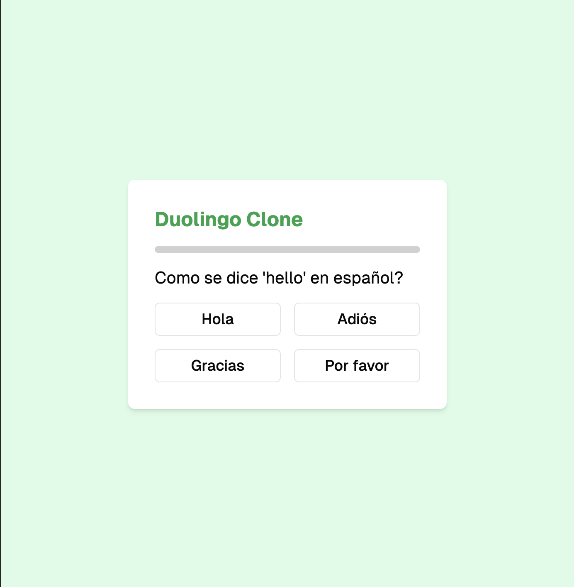

# Assignment for Week 3

## Learning Notes
- I defeinitely had to fool around with the prompt in order to get the Desired output.
- I also see some of the limitations that this approach has. The code is not designed with the rest of the project in mind (unless specified), making it hard to interface with other apps.
- Further, based on the context in which you are developing, V0.dev assumes that you have some things installed in your path to be able to use the code that it produces.

  

